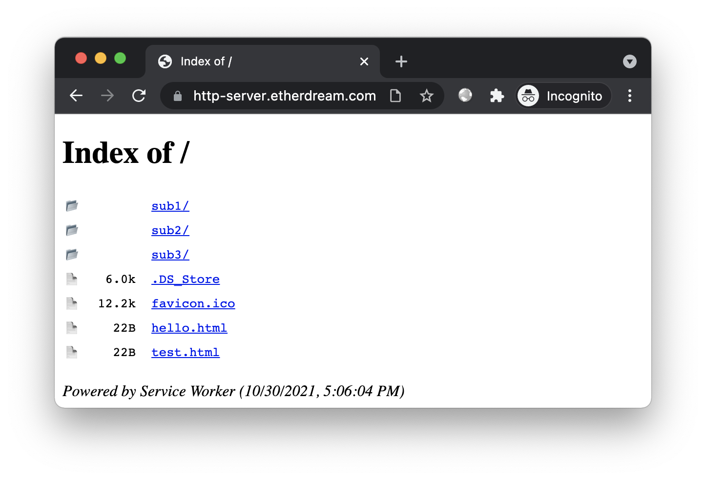

# HTTP Server Online

Start a local HTTP server without any tools, just open a web page.

## Try It Online

https://http-server.etherdream.com

OR https://hs.etherdream.com

https://user-images.githubusercontent.com/1072787/138898490-e4de9326-1715-415b-bbb6-3a377faaf618.mp4

## Custom 404

If `/path/to/foo` does not exist, we will try:

* `/path/to/404.html`

* `/path/404.html`

* `/404.html`

* return `404 Not Found`

## Index Page

For `/path/to/`, we will try:

* `/path/to/index.html`

* 404.html (`/path/to/404.html`, `/path/404.html`, `/404.html`)

* Directory Indexing

## Trailing Slash

If `/path/to` is a directory, we will redirect to `/path/to/`.

## Stop

Access `/?stop` to stop the server.

## Limitations

* Your browser must support `File System Access API` and `Service Worker API`

* The target website can not use `Service Worker API` because it is already occupied

* The target website can only be accessed in the same browser and session

## TODO

This is just a toy that took a few hours, and more interesting features will be added later.

* Tunnel (expose local server to the Internet)

* P2P (HTTP over WebRTC)

## License

MIT